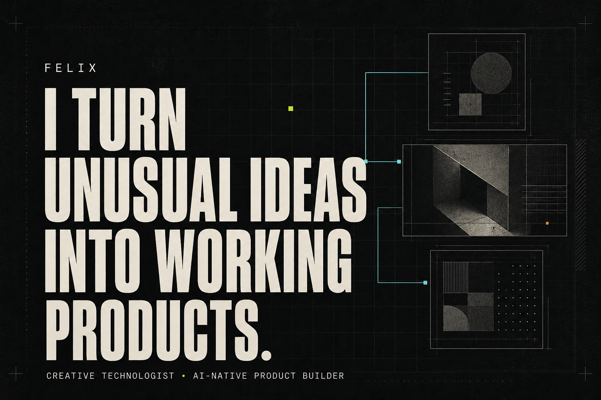

# Felix — AI-Native Product Builder & Creative Technologist

An employer-facing portfolio showing how Felix turns unusual ideas into working products through product framing, interaction direction, AI-assisted implementation, critical review, and honest shipping.

[View the public portfolio](https://ijustcreate.github.io/felix-journey/) · [Browse Felix’s GitHub](https://github.com/ijustcreate?tab=repositories)



## The candidate story

Felix works between product design, experience design, and implementation. His strongest territory is the ambiguous middle: the idea has promise, but it still needs an audience, interaction model, visual language, operating boundary, and testable form.

The portfolio makes the human–AI contribution split explicit:

- **Felix owns** the product premise, audience, experience direction, visual judgment, domain constraints, critical review, publication boundary, and final decision.
- **AI accelerates** implementation exploration, repetitive integration, debugging, test scaffolding, documentation, alternatives, and iteration speed.
- The keystrokes may be shared. Responsibility for what ships remains human.

## What Felix contributes

1. **Product framing** — turns loose concepts into audiences, environments, primary actions, constraints, and success criteria.
2. **Interaction and experience direction** — prioritizes a clear primary action, visible system state, recovery, humane language, and a distinct visual world.
3. **AI-assisted implementation leadership** — gives AI concrete context and constraints, evaluates working behavior, and steers integration across stacks.
4. **Privacy and editorial judgment** — chooses derived data over raw personal material, synthetic evidence over private media, and local-first behavior where cloud convenience creates the wrong risk.
5. **Verification and shipping** — carries prototypes through builds, tests, privacy review, CI, documentation, safe captures, and public deployment.

The language deliberately avoids claiming that Felix manually authored every line of code. The portfolio presents him as the person responsible for the intent, direction, evaluation, and release—not as a passive prompt writer or an unassisted solo engineer.

## Featured case studies

### Application Companion

A human-in-the-loop AI workflow for preparing job applications without account connection, document upload, API-key entry, autofill, or automatic submission.

**Contribution focus:** product framing, onboarding and handoff flow, privacy boundary, interaction direction, critical review, and release judgment.

**Evidence:** local prompt builder, sanitized import/export, HTTPS-only employer-page handoff, five tests, privacy audit, and [live public prototype](https://ijustcreate.github.io/application-companion/).

### Facebook Comment Collector → Video Store Backrooms

An end-to-end transformation from community conversation to public cultural artifact.

**Contribution focus:** privacy-first collection, names-off default, review and anonymization boundary, information architecture, and the video-store experience metaphor.

**Evidence:** 679 comments became 601 reviewed film recommendations. The [collector source](https://github.com/ijustcreate/facebook-comment-collector) is public, the [store is live](https://ijustcreate.github.io/video-store-backrooms/), and the raw social discussion remains private.

### Desktop Reality

A Windows prototype that treats live desktop geometry as navigable game space.

**Contribution focus:** original interaction premise, visual and game direction, AI-assisted integration across Electron/PowerShell/Canvas, and the privacy boundary around local desktop data.

**Evidence:** public source, context-isolated integration, syntax/publication checks, a multi-window smoke run, and a related C#/Electron prototype with 24 core logic tests.

## Complete evidence base

The portfolio preserves all **21 public repositories** and **11 live browser experiences** in a compact work index after the contribution story. Native projects link to source when their real behavior depends on Windows, Electron, permissions, hardware, or local data; they are not replaced with misleading static mockups.

The museum group—Space Adventure, Museum Animation Studio, Museum Newsroom, and Animal Audio Playground—demonstrates experience design beyond the screen: visitors, room geometry, hardware, staff workflow, reset, consent, and failure recovery.

## Design direction

The presentation applies Felix Flair without making the interface the subject:

- employer value before project quantity;
- genuine project captures before generated illustration;
- large, cinematic hierarchy and calm technical detail;
- flat evidence structures instead of nested dashboards;
- visible status and clear link destinations;
- restrained motion with reduced-motion support;
- one slightly crooked pixel in an otherwise disciplined grid.

The employer-facing social card is generated editorial artwork. Product images used in the site are existing project-owned captures and are documented in [ASSET_MANIFEST.md](ASSET_MANIFEST.md).

## Run and validate

Requires Node.js 22.13 or newer.

```bash
npm install
npm run dev
```

Validation:

```bash
npm run lint
npm test
```

The rendered tests verify the candidate positioning, explicit human/AI responsibility split, three featured case studies, all 21 work-index entries, key external links, and required evidence assets.

## Publishing

The same source supports two delivery targets:

- **GitHub Pages** produces a static export with `FELIX_DEPLOY_TARGET=github-pages` and publishes `dist/client` through GitHub Actions.
- **OpenAI Sites** uses the default Vinext/Cloudflare worker build and `.openai/hosting.json`.

## Accuracy and privacy

- Counts and links were reconciled against the August 2026 portfolio audit.
- The page does not claim commercial adoption, museum installation, production authentication, revenue, or measured business impact.
- Emergent Complexity is described as fork-derived work retaining upstream AGPL obligations.
- Application Companion is not presented as an automatic application-submission system or live OpenAI API integration.
- Planet Smmith is a design document; its concept image is not gameplay evidence.
- Captures containing personal interiors, desktop details, visitor media, applicant data, or client fields were excluded.
- Watcher, Life, and One Pixel MMO remain aliases/modules rather than inflated project counts.

## License

No project-wide license has been selected. Public visibility permits viewing and discussion; it does not automatically grant permission to reuse the code, writing, or artwork. Linked projects retain their own licenses and obligations.

---

Felix set the direction. AI accelerated the build. The responsibility for what appears here is human.
