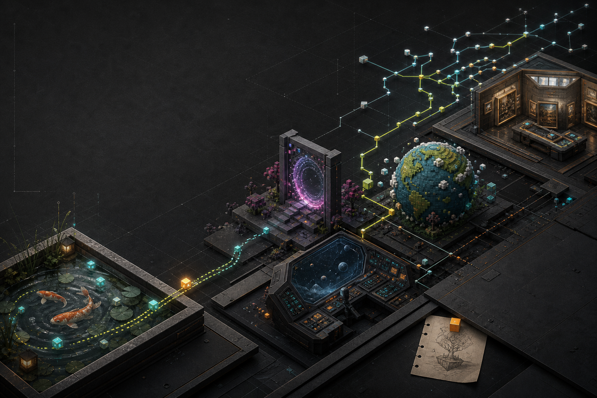

# Felix’s Journey with AI

A cinematic, evidence-backed portfolio of Felix’s public experiments with AI: **21 repositories, 11 live browser worlds, five thematic chapters, and three deliberately unresolved names**.

[View the public presentation](https://ijustcreate.github.io/felix-journey/) · [Browse Felix’s GitHub](https://github.com/ijustcreate?tab=repositories)



## What this is

This is not a generic project grid or a claim that “AI built everything.” It is a guided route through a real body of work made by Felix in collaboration with AI. The sequence is thematic rather than chronological, and every project entry keeps three things visible:

- what the project is;
- where the real source or live experience can be found;
- one important limitation, privacy boundary, or unfinished edge.

The five chapters move from explorable worlds and simulation rules through community tools, gentler work software, and desktop-scale play. The Facebook Comment Collector and Video Store Backrooms form the clearest end-to-end example: 679 comments were collected locally, reviewed and anonymized, then shaped into a public store of 601 recommended films.

## Design direction

The presentation applies **Felix Flair**: a dark, tactile foundation; cinematic scale; calm technical density; visible state; restrained motion; and one useful odd detail. Project screenshots are allowed to carry the story. Controls stay plain, links say exactly where they lead, and unsupported claims are kept out.

The generated hero artwork is a map of the journey, not a product screenshot. All project captures below it are existing project-owned assets. See [ASSET_MANIFEST.md](ASSET_MANIFEST.md) for provenance and the privacy review.

## Project map

| Chapter | Projects |
| --- | --- |
| Worlds you can enter | Recreate Space from Images, Dream Cabin Chronicles, Fish Pond, Quest Compass, Space Adventure, Portals Lab |
| Small universes, big behavior | Emergent Complexity, Codex Mobile / One Pixel MMO, Planet Smmith |
| Culture, memory, and community | Facebook Comment Collector, Video Store Backrooms, The Muses Library, Animal Audio Playground, Museum Newsroom, Museum Animation Studio |
| Tools that know when to stop | Media Watcher, Application Companion, Rollwright, ZenDeck |
| When the desktop becomes the stage | Desktop Reality, Desktop Geometry Wars |

Aliases and modules remain attached to their real homes: **Watcher** is Media Watcher, **Life** belongs to Emergent Complexity, and **One Pixel MMO** lives inside Codex Mobile. **Builder**, **Pixel 3D World**, and **Open Human** remain visibly unresolved until their authoritative artifacts are identified.

## Run locally

Requires Node.js 22.13 or newer.

```bash
npm install
npm run dev
```

Then open the local URL printed by Vinext.

Validation:

```bash
npm run lint
npm test
```

`npm test` produces a Sites-compatible build and verifies the rendered portfolio, external project links, publication language, and required asset manifest.

## Publishing

The repository supports two delivery targets from the same source:

- **GitHub Pages** builds a static export with `FELIX_DEPLOY_TARGET=github-pages` and publishes `dist/client` through `.github/workflows/deploy-pages.yml`.
- **OpenAI Sites** uses the default Vinext/Cloudflare worker build and the configuration in `.openai/hosting.json`.

The GitHub target intentionally uses a Vite asset base plus `NEXT_PUBLIC_ASSET_BASE`. Vinext 0.0.50 cannot prerender this site reliably with a conventional Next.js `basePath`, so hand-written public asset URLs are prefixed explicitly.

## Structure

```text
app/
  layout.tsx       metadata and page shell
  page.tsx         verified project data and presentation markup
  globals.css      complete visual and responsive system
public/
  og.png           generated journey-map artwork
  projects/        curated project-owned captures
.github/workflows/ deploy GitHub Pages
.openai/            Sites project configuration
tests/              rendered-output and asset-boundary checks
```

## Accuracy and privacy

- Counts and links were reconciled against the portfolio audit on 2026-08-05/06.
- Native apps link to source rather than pretending a static mockup is the product.
- Captures with desktop chrome, personal interiors, user labels, or client fields were omitted from this portfolio even when they existed elsewhere.
- Planet Smmith artwork is explicitly labeled concept art, not gameplay.
- Public visibility does not grant reuse rights where an individual project has no license.
- No analytics, accounts, application uploads, or personal project data are used by this presentation.

## License

No project-wide license has been selected. The repository is public to view and discuss; that does not automatically grant permission to reuse its code, writing, or artwork. Linked projects retain their own licenses and obligations.

---

Built with AI. Edited with judgment. Verified before publication.
